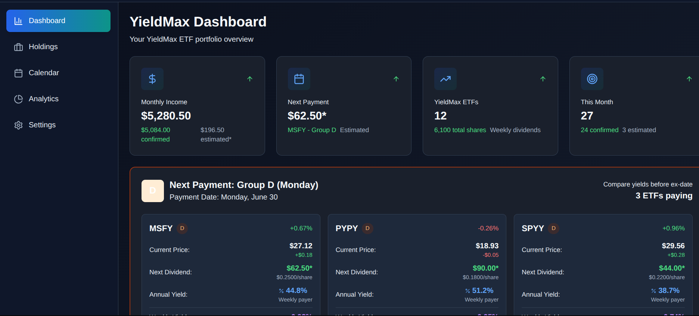
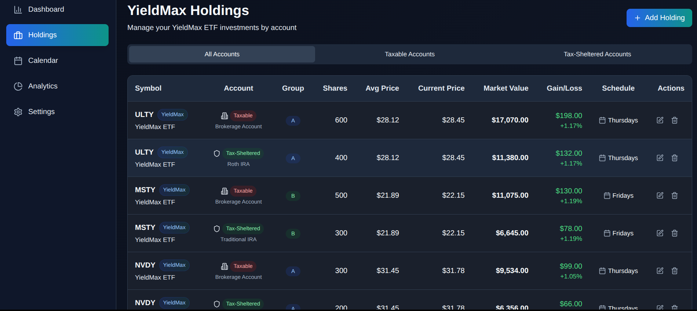
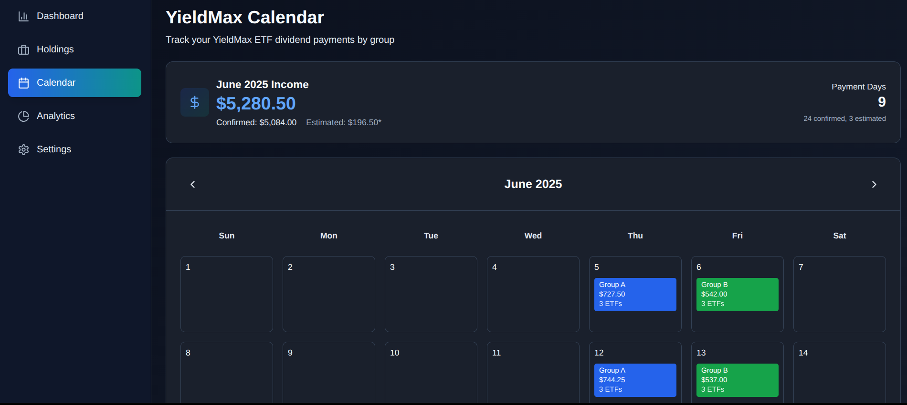
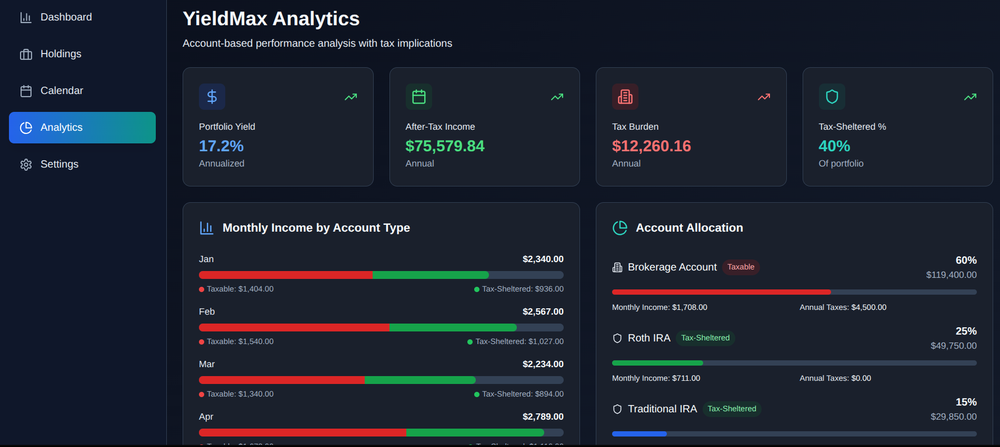
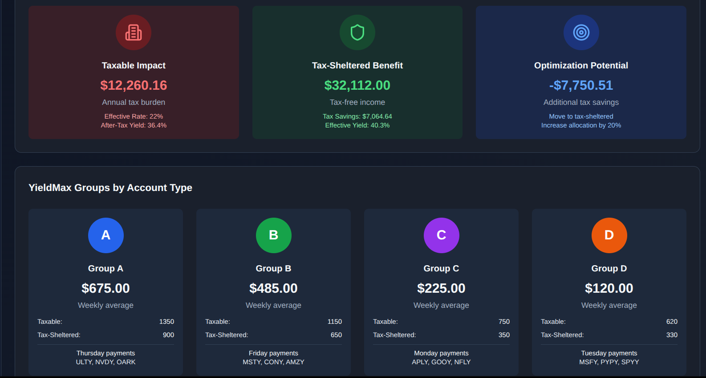
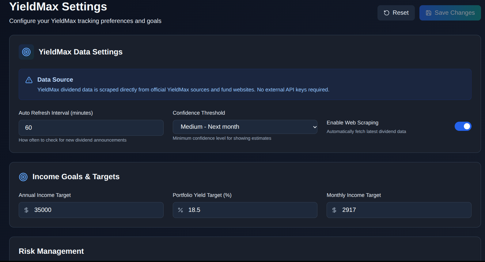

# YieldMax Dividend Tracker

This is a YieldMax ETF dividend tracking application, built with Vite, React, and TypeScript. It provides a dashboard, holdings management, a dividend calendar, analytics, and settings for managing your YieldMax ETF investments.

---

## Project Overview

This application aims to provide a comprehensive tool for investors to track their dividend income from YieldMax ETFs and other dividend-paying stocks. It includes features for:

* **Dashboard:** A quick overview of your portfolio, monthly income, and next payments.
* **Holdings:** Manage your ETF holdings, including cost basis and account types (taxable vs. tax-sheltered).
* **Calendar:** Visualize upcoming and past dividend payments, grouped by YieldMax payment schedules.
* **Analytics:** Detailed breakdown of income by account type, tax implications, and performance metrics.
* **Settings:** Customize your income goals, risk management preferences, notifications, and display options.

---

## Screenshots

Below are screenshots illustrating various sections of the YieldMax Dividend Tracker application.

### Dashboard

The dashboard provides a high-level overview of your current monthly income, next payment details, total YieldMax ETFs and shares, and a summary of this month's payments.



### Holdings

Manage your YieldMax ETF holdings with a breakdown by account type (taxable vs. tax-sheltered), group, shares, average price, current price, and real-time gain/loss. It also includes an account summary and tax implications overview.



### Dividend Calendar

The dividend calendar provides a clear view of all confirmed and estimated dividend payments for your YieldMax ETFs. Payments are displayed on their respective **`payDate`s**.

* **Group A ETFs pay on Thursdays.**
* **Group B ETFs pay on Fridays.**
* **Group C ETFs pay on Mondays.**
* **Group D ETFs pay on Tuesdays.**

Estimated payments are marked with an asterisk (`*`) and include a confidence level based on historical patterns and official announcements.



### Analytics

Dive deeper into your portfolio's performance with detailed analytics. This section includes monthly income breakdowns by account type, overall account allocation, tax optimization analysis, and performance metrics considering tax implications.




### Settings

Customize your YieldMax tracking preferences, set income goals, configure risk management parameters, manage notifications, and adjust display preferences.



---

## Getting Started

### Prerequisites

* Node.js (>=18.0.0)
* npm or Yarn

### Installation

1.  Clone the repository:
    ```bash
    git clone [https://github.com/mphinance/yieldmax.git](https://github.com/mphinance/yieldmax.git)
    cd yieldmax
    ```
2.  Install dependencies:
    ```bash
    npm install
    # or yarn install
    ```

### Running the Application

* **Development Mode:**
    ```bash
    npm run dev
    # or yarn dev
    ```
    This will start the development server, usually at `http://localhost:5173`.
* **Build for Production:**
    ```bash
    npm run build
    # or yarn build
    ```
    This compiles the application for production, outputting static files to the `dist` directory.
* **Preview Production Build:**
    ```bash
    npm    run preview
    # or yarn preview
    ```

---

## Technologies Used

* **React:** Frontend library
* **TypeScript:** Type-safe JavaScript
* **Vite:** Fast build tool
* **Tailwind CSS:** Utility-first CSS framework
* **Lucide React:** Icon library

---

## Data Sources

Dividend data, including confirmed payments and estimates, is sourced from official YieldMax announcements, SEC filings, and fund websites. Mock market data is used for demonstration purposes.

---

## Contributing

Feel free to open issues or submit pull requests if you have suggestions for improvements or bug fixes.

---

## License

[Specify your license here, e.g., MIT License]
